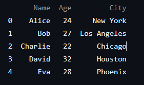

### 판다스 스터디

# Pandas_Study
## 1.pandas 불러오기

pandas를 사용하려면 파이썬 코드 상단에 import 문을 작성하여 불러옵니다.
```
import pandas as pd
```
## 2. 데이터 생성 및 DataFrame 만들기

pandas에서 가장 기본이 되는 데이터 구조는 DataFrame입니다. DataFrame은 행과 열로 이루어진 2차원 데이터 구조입니다.

예제 1: 간단한 DataFrame 생성

import pandas as pd

### 데이터 생성
```
data = {
    'Name': ['Alice', 'Bob', 'Charlie', 'David', 'Eva'],
    'Age': [24, 27, 22, 32, 28],
    'City': ['New York', 'Los Angeles', 'Chicago', 'Houston', 'Phoenix']
}
```

### DataFrame 생성

```
df = pd.DataFrame(data)
```

### DataFrame 출력
```
print(df)
```


## 3. DataFrame 조회
pandas는 데이터를 쉽게 조회할 수 있는 다양한 메소드를 제공합니다.

예제 2: 데이터 조회
